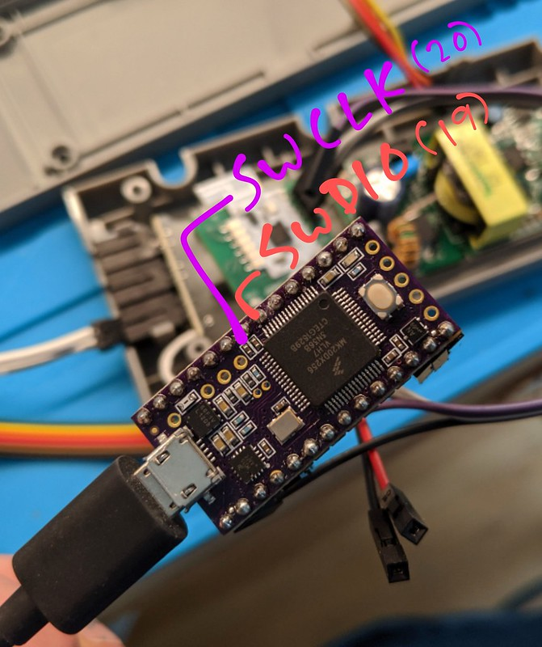

# CMSIS-DAP USB-SWD/JTAG HID adapter firmware for Teensy 3.2 boards

Copyright (C) 2016 Phillip Pearson <pp@myelin.nz>

based on the <a href="https://github.com/mbedmicro/CMSIS-DAP">CMSIS-DAP Interface Firmware</a>

Copyright (c) 2009-2013 ARM Limited

This is a port of the core of ARM's CMSIS-DAP firmware to the Arduino environment,
which lets you turn a <a href="https://www.pjrc.com/store/teensy32.html">Teensy 3.2</a> into a
CMSIS-DAP USB adapter, which you can use with OpenOCD and mbed to program and debug ARM chips
using the SWD protocol, and also with OpenOCD to program and debug various chips using JTAG.

# Compiling

Since the CMSIS-DAP uses a Raw HID mode it is necessary to modify the Teensy's `usb_desc.h`
file to have one that supports both Raw HID and CDC Serial at the same time.  Back up the
`hardware/teensy/avr/cores/teensy3/usb_desc.h` file and replace it with the one from this
directory.  When you build the firmware, be sure to select `Raw HID` from the `Tools - USB Type`
menu.

# Wiring



Pin | Function
----|--------
0   | Serial TX (from Teensy into device)
1   | Serial RX (from device into Teensy)
19  | `SWDIO`
20  | `SWCLK`

You will also need to connect a ground pin.

The serial port is 115200 with no flow control and 3.3V signalling. These pins are 5V tolerant,
but do not connect to RS232 levels.

# Debugging

```
openocd  -f interface/cmsis-dap.cfg -f board/efm32.cfg
```

Sometimes the device doesn't seem to initialize correctly and this command
exits rather than initializing the connection.  Powering off the device
under test for a few seconds seems to help it resume, although it has
been hard to debug.

Assuming `openocd` is working, in another window run `telnet localhost 4444` to connect to it.
Some useful commands:

* `reset halt` - stop the execution and halt the device
* `reset run` - stop the execute and reboot the device
* `halt` - stop the device execution
* `resume` - resume device execution
* `reg` - dump the registers while the device is halted
* `flash read_bank 0 path/to/output` - read the device firmware into a file for analysis
* `flash write_image erase path/to/file` - write a new firmware image into the device

More complicated functions can be performed with GDB talking to OpenOCD.

